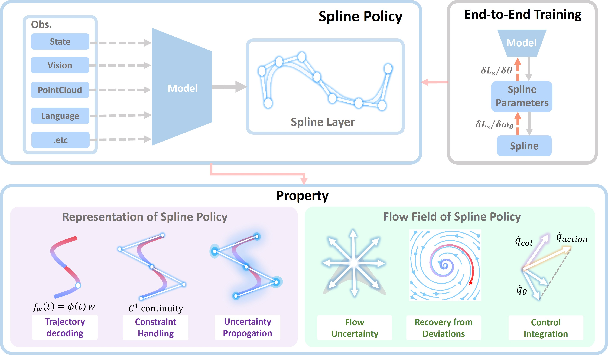

# Spline Policy: A Structured Representation for Robot Policies

Mengze Tian<sup>1,†</sup>, Yiming Li<sup>2,1,†</sup>, Sichao Liu<sup>1</sup>, Auke Ijspeert<sup>1</sup>, Sylvain Calinon<sup>2,1</sup>.

<sup>1</sup>École Polytechnique Fédérale de Lausanne (EPFL), Lausanne, Switzerland,
<sup>2</sup>Idiap Research Institute, Martigny, Switzerland,
<sup>†</sup> Equal Contribution,
Corresponding author: Yiming Li (<yiming.li@epfl.ch>)



This repository has been refactored and trimmed down for open-sourcing with the help of [Claude Code](https://claude.com/claude-code). If anything looks broken or missing, please [get in touch](#contact).

## Installation

Install [micromamba](https://mamba.readthedocs.io/en/latest/installation/micromamba-installation.html) if you don't have it:

```console
"${SHELL}" <(curl -L micro.mamba.pm/install.sh)
```

```console
micromamba env create -f myenv.yml --channel-priority flexible   # or: conda env create -f myenv.yml (much slower to solve)
micromamba activate robomimic_py38
cd spline_policy
```

To run the notebooks, select `robomimic_py38` as the Jupyter kernel in your notebook UI.

For data, download the
datasets following [Diffusion Policy](https://github.com/real-stanford/diffusion_policy).

## Usage

The main entry point is [`spline_policy/notebooks/spline_policy_demo.ipynb`](spline_policy/notebooks/spline_policy_demo.ipynb), which walks through the method end to end:

- Trajectory encoding/decoding with the quadratic spline
- Continuity across replanning
- Flow field and perturbation recovery
- Uncertainty propagation
- Null-space control integration
- Compatibility with other backbones, and how to launch training
- Push-T deployment with high-rate flow-field execution and disturbance recovery

[`spline_policy/metrics/`](spline_policy/metrics) collects the benchmark tables and plots reported in the paper. The point-cloud tasks (`adroit_door`, `adroit_pen`, `dexart_laptop`) were produced with SP ported onto a [3D Diffusion Policy (DP3)](https://github.com/YanjieZe/3D-Diffusion-Policy) backbone; that integration isn't part of this release, but follows the same pattern.

## Citation

```bibtex
@article{tian2026spline,
  title={Spline Policy: A Structured Representation for Robot Policies},
  author={Tian, Mengze and Li, Yiming and Liu, Sichao and Ijspeert, Auke and Calinon, Sylvain},
  journal={arXiv preprint arXiv:2606.07386},
  year={2026}
}
```

## License
This repository is released under the MIT license. See [LICENSE](LICENSE) for additional details.

## Acknowledgement
* This codebase is built on top of [Diffusion Policy](https://github.com/real-stanford/diffusion_policy).
* Our [`ConditionalUnet1D`](./spline_policy/policy/diffusion_policy/model/diffusion/conditional_unet1d.py) implementation is adapted from [Planning with Diffusion](https://github.com/jannerm/diffuser).
* Our [MP-DF-DS](./spline_policy/policy/diffusion_policy/planning/quadratic_spline.py) implementation is adapted from [MP-DF-DS](https://github.com/mp-df-ds/mp-df-ds).
* The [Push-T](./spline_policy/policy/diffusion_policy/env/pusht) task is adapted from [IBC](https://github.com/google-research/ibc).
* The [Demonstration](./spline_policy/policy/diffusion_policy/env/demonstration) task is adapted from [LASAHandwritingDataset](https://bitbucket.org/khansari/lasahandwritingdataset/src/master/).

## Contact

If you have any questions, please feel free to contact Mengze TIAN (<mengze.tian@epfl.ch>).
